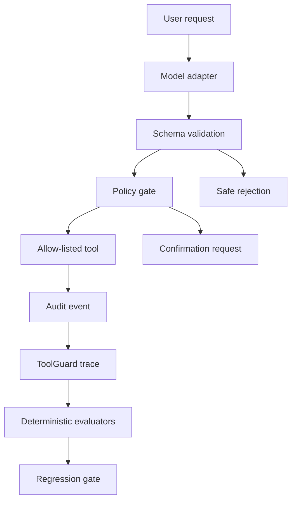

# Evaluated Order Support Agent

A production-shaped portfolio project demonstrating safe LLM tool execution for e-commerce support. The agent validates every proposed call, applies policy checks, executes only allow-listed tools, records an audit trace, and is evaluated against a locked behavioral benchmark.

The repository now also contains **ToolGuard Core v0**: a provider-agnostic reliability layer for scoring agent traces and blocking regressions before release.

## What this demonstrates

- Typed tool schemas and strict argument validation
- Separation between model decisions and real-world execution
- Confirmation gates for destructive actions
- Prompt-injection and unknown-tool rejection
- Deterministic audit logs with latency and outcome
- Reproducible behavioral evaluation
- Provider-agnostic agent trace evaluation
- Candidate-vs-baseline regression gates for CI

The default demo uses a deterministic `ReplayModel`, so it runs without a GPU or API key. `TransformersAdapter` loads the published Qwen3 QLoRA adapter for real inference on suitable hardware.

## Quick start

```bash
python -m order_agent.demo
python -m order_agent.eval
python -m unittest discover -s tests -v
```

Measured on a Kaggle T4 with the published adapter: **12/12 guarded-agent cases passed (100%)** in 31.19 seconds. See [the benchmark report](docs/BENCHMARK.md) and [machine-readable evidence](reports/real_model_benchmark_report.json).

## ToolGuard Core v0

ToolGuard evaluates agent behavior at the trace level instead of judging only the final answer. It scores routing, tool selection, argument correctness, no-tool behavior, confirmation gates, and tool execution, while retaining latency/token/cost diagnostics.

```bash
python -m toolguard.cli evaluate examples/toolguard_traces.jsonl
python -m toolguard.cli compare examples/toolguard_baseline.jsonl examples/toolguard_candidate_regression.jsonl
```

The compare command exits non-zero when a candidate exceeds the configured regression budget, so it can act as a release gate in GitHub Actions.

See [ToolGuard architecture and usage](docs/TOOLGUARD.md) and the [implementation roadmap](TOOLGUARD_ROADMAP.md).

Run the Gradio demo:

```bash
pip install -e '.[demo]'
python app.py
```

Run with the real model on GPU-capable hardware:

```bash
pip install -e '.[model,demo]'
MODEL_MODE=transformers python app.py
```

Run the same locked benchmark against the real adapter:

```bash
python -m order_agent.eval --model transformers
```

The UI always displays its active mode. Mutations remain simulated in both modes.

## Safety model

The real-model path exposes the trained `get_order` and `check_inventory` tools. Calls execute only after schema validation and identifier grounding against the user's request. The replay path also demonstrates confirmation-gated simulated mutations. Unknown tools, malformed arguments, invented identifiers, and instruction-injection attempts are blocked before execution.

## Architecture



## Next production integrations

1. Feed the existing order-agent audit events directly into ToolGuard traces.
2. Persist traces to PostgreSQL and add OpenTelemetry spans.
3. Add failure replay and benchmark registry APIs.
4. Add a FastAPI service and dashboard for candidate-vs-baseline comparisons.
5. Run shadow-mode evaluation before enabling any live mutation.

No credentials, customer records, or live commerce operations are included.
