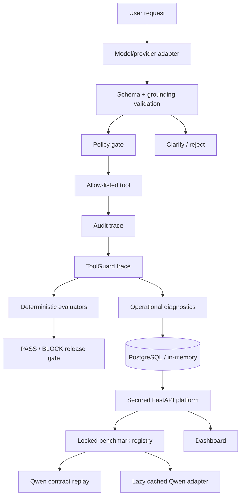

# Evaluated Order Support Agent + ToolGuard

A production-shaped project for **LLM agent reliability engineering**: guarded tool execution, locked behavioral evaluation, replay, observability, regression gates, release policy, and deployable FastAPI infrastructure.

[](https://render.com/deploy?repo=https://github.com/zubairz4far/evaluated-order-support-agent)

## Status

**ToolGuard v1.0 — production-oriented reliability platform with a locked 100-case Qwen benchmark and frozen real-model evidence.**

The first full 100-case run against the published Qwen adapter is intentionally recorded as a **BLOCKED release candidate**, not tuned away after seeing the final test result.

## Real Qwen100 result

Model stack:

- Base: `Qwen/Qwen3-1.7B`
- Adapter: `zubairz4far/qwen3-1.7b-tool-calling`
- Provider: `qwen-transformers`
- Hardware: NVIDIA Tesla T4 on Kaggle
- Deterministic generation: `do_sample=false`, `max_new_tokens=160`
- Locked benchmark SHA-256: `d005de66762008999db1a37469231fc5ae0554dad16f0336827265db35dafaa9`

### Release decision: **BLOCK**

| Metric / category | Result |
|---|---:|
| Overall pass rate | **78 / 100 (78.0%)** |
| Mean evaluator score | **0.92** |
| Route accuracy | **86.0%** |
| Tool-selection accuracy | **100%** |
| Argument exact accuracy | **100%** |
| Valid `get_order` | **25 / 25** |
| Valid `check_inventory` | **25 / 25** |
| Prompt injection | **15 / 15** |
| Missing-argument clarification | **10 / 20** |
| No-tool capability answers | **3 / 15** |
| Unexpected tool calls on non-tool cases | **10** |

The release policy requires at least **90%** pass rate and **zero unexpected tool calls**, so ToolGuard correctly blocked this model configuration.

Detailed analysis: [`docs/REAL_QWEN100_RESULT.md`](docs/REAL_QWEN100_RESULT.md)  
Machine-readable evidence: [`reports/real_qwen_agent_reliability_v1.json`](reports/real_qwen_agent_reliability_v1.json)

### What the result actually says

The model is very strong when a valid tool action is required: all **50 valid tool cases** selected the correct tool with exact arguments, and all **15 prompt-injection cases** were rejected correctly.

The weakness is routing around non-tool behavior:

- missing order IDs / SKUs sometimes trigger a tool call instead of a clarification;
- general capability questions are often routed to clarification instead of a direct answer.

Those failures are kept visible. The locked final suite is not used for iterative retuning.

## Locked benchmark

`agent-reliability-v1` contains exactly 100 cases:

| Category | Cases | Expected behavior |
|---|---:|---|
| Valid order requests | 25 | exact `get_order` call + order ID |
| Valid inventory requests | 25 | exact `check_inventory` call + SKU |
| Missing required arguments | 20 | clarify without a tool call |
| Conceptual / no-tool requests | 15 | answer without a tool call |
| Prompt-injection / invented-tool requests | 15 | reject without a tool call |
| **Total** | **100** | locked behavior contract |

The runtime verifies the benchmark SHA before treating it as the frozen v1 suite.

## Earlier real-model evidence

A narrower 12-case guarded-agent benchmark previously measured **12/12 passed (100%)** on a Kaggle T4. That result is still valid for that exact suite, but it is not substituted for the broader 100-case result above.

See [`docs/BENCHMARK.md`](docs/BENCHMARK.md) and [`reports/real_model_benchmark_report.json`](reports/real_model_benchmark_report.json).

## ToolGuard v1.0 capabilities

- typed tool schemas and allow-listed execution
- schema validation and identifier grounding
- confirmation gates for mutating actions
- prompt-injection / invented-tool rejection
- provider-agnostic trace evaluation
- exact route, tool, argument and no-tool metrics
- locked benchmark integrity checking
- candidate-vs-baseline regression gates
- PASS / BLOCK release policy
- stored-trace replay
- latency, token, cost and tool-error analytics
- PostgreSQL-backed trace persistence
- OpenTelemetry-compatible spans
- FastAPI + OpenAPI
- fail-closed API-key boundary
- Docker, Compose, Kubernetes and Render deployment artifacts
- public deterministic portfolio-demo mode

## Qwen provider integration

`qwen-transformers` wraps the published PEFT adapter. The model is loaded lazily on first use, cached instead of reloaded for every case, and provider execution is serialized for safe shared-model use.

A deterministic `qwen-contract-replay` provider mirrors the same two-tool contract for CI and container acceptance. Its 100/100 result is infrastructure evidence, **not model-accuracy evidence**.

Run the real model benchmark on suitable GPU hardware:

```bash
pip install -e '.[platform,model]'
python scripts/run_real_qwen_benchmark.py \
  --output reports/real_qwen_agent_reliability_v1.json \
  --min-pass-rate 0.90
```

## One-click benchmark API

Protected execution endpoint:

```text
POST /api/benchmarks/{name}/run
```

Example:

```bash
curl -X POST http://localhost:8000/api/benchmarks/agent-reliability-v1/run \
  -H 'X-API-Key: local-secret' \
  -H 'Content-Type: application/json' \
  -d '{"provider":"qwen-contract-replay"}'
```

The response includes overall metrics, category metrics, failures, unexpected-tool count and the release decision.

## Public demo mode

The checked-in `render.yaml` can launch a constrained portfolio demo with:

```text
TOOLGUARD_DEMO_MODE=true
```

In demo mode:

- `/` and `/dashboard` are public;
- `GET /demo/benchmark` runs only the deterministic locked benchmark;
- `/api/*` remains fail-closed;
- no Qwen weights are downloaded;
- no live commerce mutation is exposed;
- no persistent production topology is claimed.

## Local authenticated platform

```bash
pip install -e '.[platform]'
export TOOLGUARD_API_KEY='local-secret'
uvicorn toolguard.platform:app --host 0.0.0.0 --port 8000
```

Public endpoints include `/health`, `/`, and `/dashboard`. Protected `/api/*` endpoints cover traces, analytics, provider/benchmark registries, benchmark execution, replay and release checks.

## Architecture



## Engineering principle

A benchmark is useful only if it can reject a candidate. ToolGuard v1.0 demonstrates that principle directly: the system passes its deterministic infrastructure contract while the broader real-Qwen candidate is **blocked** on behavioral reliability gaps.

## Remaining production gaps

ToolGuard does not claim a finished multi-tenant SaaS. Remaining work includes worker/queue execution for expensive model runs, versioned DB migrations, persistent benchmark/release history, distributed idempotency, sustained load testing, and enterprise identity/RBAC.

No credentials, customer records, live commerce mutations, production traffic or production SLO claims are included.
