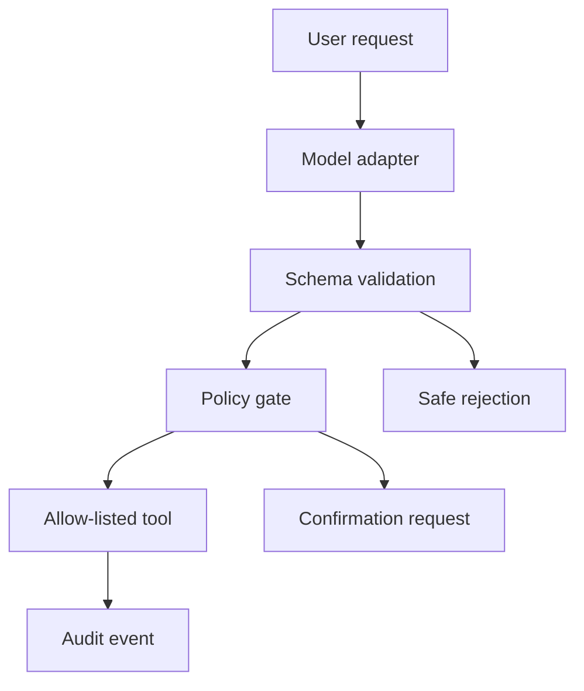

# Evaluated Order Support Agent

A production-shaped portfolio project demonstrating safe LLM tool execution for e-commerce support. The agent validates every proposed call, applies policy checks, executes only allow-listed tools, records an audit trace, and is evaluated against a locked behavioral benchmark.

## What this demonstrates

- Typed tool schemas and strict argument validation
- Separation between model decisions and real-world execution
- Confirmation gates for destructive actions
- Prompt-injection and unknown-tool rejection
- Deterministic audit logs with latency and outcome
- Reproducible behavioral evaluation

The default demo uses a deterministic ReplayModel, so it runs without a GPU or API key. ModelAdapter is the integration boundary for the Qwen3 QLoRA adapter.

## Quick start

```bash
python -m order_agent.demo
python -m order_agent.eval
python -m unittest discover -s tests -v
```

Expected benchmark: **12/12 cases pass**.

## Safety model

Read-only calls execute after schema validation. Mutating calls require explicit user confirmation. Unknown tools, malformed arguments, and instruction-injection attempts are rejected before execution.

## Architecture



## Model

Fine-tuned adapter: [zubairz4far/qwen3-1.7b-tool-calling](https://huggingface.co/zubairz4far/qwen3-1.7b-tool-calling)

No credentials, customer records, or live commerce operations are included.
