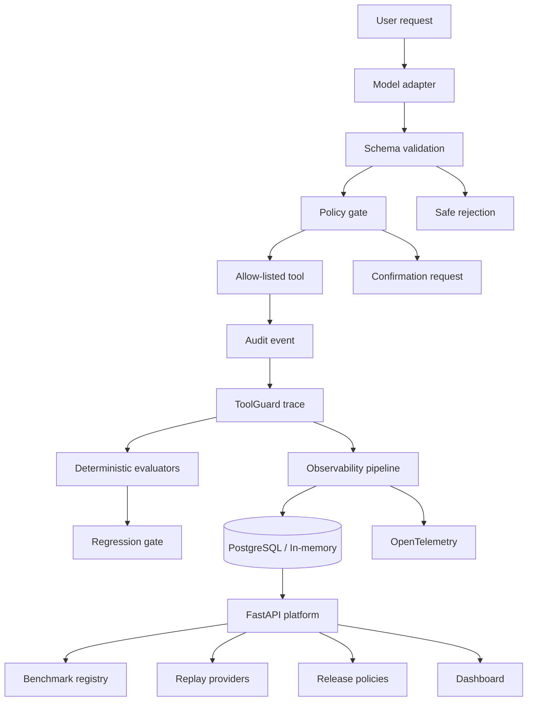

# Evaluated Order Support Agent

A production-shaped portfolio project demonstrating safe LLM tool execution for e-commerce support. The agent validates every proposed call, applies policy checks, executes only allow-listed tools, records an audit trace, and is evaluated against a locked behavioral benchmark.

The repository also contains **ToolGuard**, a provider-agnostic reliability platform for evaluating agent traces, blocking regressions, persisting runs, exporting telemetry, replaying failures, and enforcing release policies through an API.

## What this demonstrates

- Typed tool schemas and strict argument validation
- Separation between model decisions and real-world execution
- Confirmation gates for destructive actions
- Prompt-injection and unknown-tool rejection
- Deterministic audit logs with latency and outcome
- Reproducible behavioral evaluation
- Provider-agnostic agent trace evaluation
- Candidate-vs-baseline regression gates for CI
- PostgreSQL-ready trace persistence
- OpenTelemetry-compatible agent/tool spans
- Latency, token, cost, and tool-error analytics
- Stored-trace replay with candidate comparison
- FastAPI service + OpenAPI contract
- Versioned benchmark registry
- Configurable release policies
- Lightweight operational dashboard
- Model/provider adapter interface

The default agent demo uses a deterministic `ReplayModel`, so it runs without a GPU or API key. `TransformersAdapter` loads the published Qwen3 QLoRA adapter for real inference on suitable hardware.

## Quick start

```bash
python -m order_agent.demo
python -m order_agent.eval
python -m unittest discover -s tests -v
```

Measured on a Kaggle T4 with the published adapter: **12/12 guarded-agent cases passed (100%)** in 31.19 seconds. See [the benchmark report](docs/BENCHMARK.md) and [machine-readable evidence](reports/real_model_benchmark_report.json).

## ToolGuard CLI

ToolGuard evaluates behavior at the trace level instead of judging only the final answer. It scores routing, tool selection, argument correctness, no-tool behavior, confirmation gates, and execution, while retaining operational diagnostics.

```bash
python -m toolguard.cli evaluate examples/toolguard_traces.jsonl
python -m toolguard.cli analytics examples/toolguard_traces.jsonl
python -m toolguard.cli compare examples/toolguard_baseline.jsonl examples/toolguard_candidate_regression.jsonl
```

The compare command exits non-zero when a candidate exceeds the configured regression budget, so it can act as a release gate in GitHub Actions.

## ToolGuard v0.3 platform

Install and run the API locally:

```bash
pip install -e '.[platform]'
uvicorn toolguard.platform:app --host 0.0.0.0 --port 8000
```

Then open:

- `/dashboard` for the built-in operational dashboard
- `/docs` for FastAPI/OpenAPI documentation
- `/api/analytics` for trace-level operational metrics
- `/api/benchmarks` for the benchmark registry
- `/api/providers` for replay providers

The platform uses an in-memory store by default. PostgreSQL is enabled by setting `TOOLGUARD_DATABASE_URL` and installing the `observability` extra.

Release thresholds can be configured with `TOOLGUARD_MIN_PASS_RATE`, `TOOLGUARD_MAX_PASS_RATE_DROP`, and `TOOLGUARD_MAX_METRIC_DROP`, or supplied per API request.

The default provider registry includes a deterministic identity replay and the existing guarded order-agent replay. A lazy `qwen_order_agent_provider()` factory wraps the published Transformers/PEFT path without loading the model at API startup.

See [ToolGuard architecture and usage](docs/TOOLGUARD.md), [v0.2 observability](docs/TOOLGUARD_OBSERVABILITY.md), [v0.3 platform](docs/PLATFORM.md), and the [implementation roadmap](TOOLGUARD_ROADMAP.md).

## Existing agent demo

Run the Gradio demo:

```bash
pip install -e '.[demo]'
python app.py
```

Run with the real model on GPU-capable hardware:

```bash
pip install -e '.[model,demo]'
MODEL_MODE=transformers python app.py
```

Run the same locked benchmark against the real adapter:

```bash
python -m order_agent.eval --model transformers
```

The UI always displays its active mode. Mutations remain simulated in both modes.

## Safety model

The real-model path exposes the trained `get_order` and `check_inventory` tools. Calls execute only after schema validation and identifier grounding against the user's request. The replay path also demonstrates confirmation-gated simulated mutations. Unknown tools, malformed arguments, invented identifiers, and instruction-injection attempts are blocked before execution.

## Architecture



## Next production hardening

1. Add authentication/API keys.
2. Replace startup schema creation with migrations.
3. Add asynchronous replay workers for expensive model runs.
4. Persist benchmark definitions and release-policy history.
5. Add Docker/deployment manifests and load testing.

No credentials, customer records, or live commerce operations are included.
