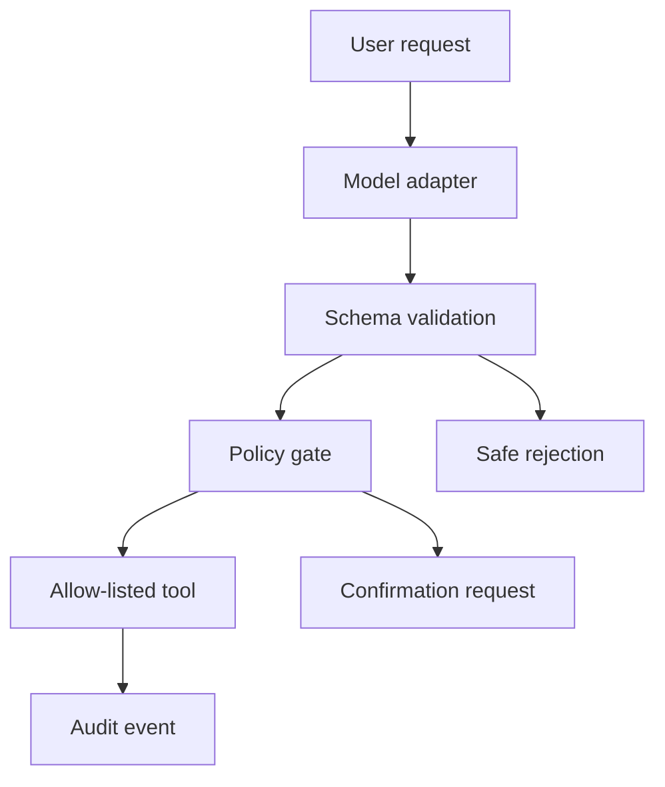

# Evaluated Order Support Agent

A production-shaped portfolio project demonstrating safe LLM tool execution for e-commerce support. The agent validates every proposed call, applies policy checks, executes only allow-listed tools, records an audit trace, and is evaluated against a locked behavioral benchmark.

## What this demonstrates

- Typed tool schemas and strict argument validation
- Separation between model decisions and real-world execution
- Confirmation gates for destructive actions
- Prompt-injection and unknown-tool rejection
- Deterministic audit logs with latency and outcome
- Reproducible behavioral evaluation

The default demo uses a deterministic `ReplayModel`, so it runs without a GPU or API key. `TransformersAdapter` loads the published Qwen3 QLoRA adapter for real inference on suitable hardware.

## Quick start

```bash
python -m order_agent.demo
python -m order_agent.eval
python -m unittest discover -s tests -v
```

Expected benchmark: 12/12 cases pass.

Run the Gradio demo:

```bash
pip install -e '.[demo]'
python app.py
```

Run with the real model on GPU-capable hardware:

```bash
pip install -e '.[model,demo]'
MODEL_MODE=transformers python app.py
```

Run the same locked benchmark against the real adapter:

```bash
python -m order_agent.eval --model transformers
```

The UI always displays its active mode. Mutations remain simulated in both modes.

## Safety model

Read-only calls (`get_order`, `track_shipment`, `get_inventory`) execute after schema validation. Mutating calls (`cancel_order`, `create_refund`) require explicit user confirmation. Unknown tools, malformed arguments, and instruction-injection attempts are rejected before execution.

## Architecture



## Next production integrations

1. Run the real-model benchmark on GPU hardware and publish the measured report.
2. Replace the in-memory store with read-only Shopify/PostEx adapters behind the same registry.
3. Persist traces to PostgreSQL and add OpenTelemetry spans.
4. Run shadow-mode evaluation before enabling any live mutation.

No credentials, customer records, or live commerce operations are included.
